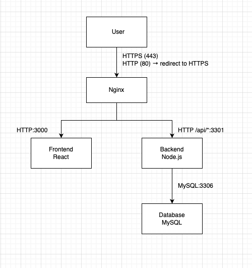

# Task Manager 

## Описание

Приложение за създаване и управление на задачи. Можеш да добавяш задачи да различни дни, да маркираш задачите като изпълнени, да ги редактираш и триеш.

## Архитектура



## Компоненти

### 1. Frontend (React)
- **Технология:** React + Vite + Tailwind CSS

### 2. Backend API (Node.js/Express)
- **Технология:** Node.js + Express

### 3. Database (MySQL)
- **Технология:** MySQL 8.0
- **База данни:** calendar_db
- **Таблица:** tasks


### 5. SSL/TLS
- **Тип:** Self-signed сертификат

## Стартиране

### Първоначална настройка

1. **Клониране/Изтегляне на проекта**
```bash
cd calendar_app
```

2. **Създаване на .env файл**
```
MYSQL_ROOT_PASSWORD=rootpass
MYSQL_DATABASE=calendar_db
MYSQL_USER=appuser
MYSQL_PASSWORD=apppass
```

3. **Стартиране на контейнерите**
```bash
docker compose up -d --build
```

4. **Проверка на статуса**
```bash
docker compose ps
```

https://localhost (или http://localhost - автоматично пренасочва към HTTPS)


## Структура на проекта

```
calendar_app/
├── backend/             # Node.js/Express API
│   ├── src/
│   │   ├── index.js     # API endpoints
│   │   └── db.js        # Database connection
│   └── Dockerfile
├── frontend/            # React приложение
│   ├── src/
│   │   ├── App.jsx      # Главен компонент
│   │   ├── api.js       # API функции
│   │   └── Modal.jsx    # Модални прозорци
│   └── Dockerfile
├── mysql/
│   └── init/
│       └── 01_schema.sql # Database schema
├── nginx/
│   ├── nginx.conf        # Nginx конфигурация
│   └── ssl/              # SSL сертификати
│       ├── server.crt
│       └── server.key
├── docker-compose.yml    # Docker Compose конфигурация
├── .env                  # Environment variables
└── README.md            # Документация
```

